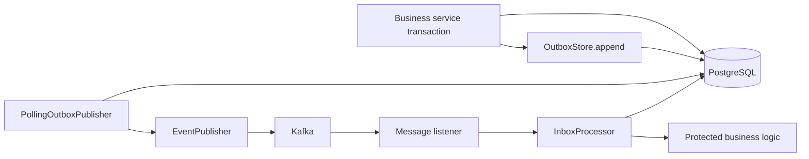
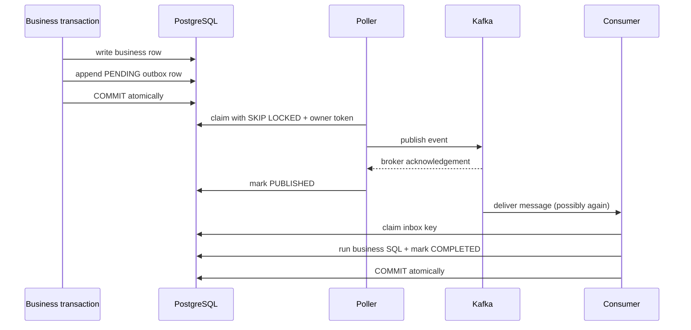

# Spring Outbox Inbox

Spring Outbox Inbox provides reusable PostgreSQL transactional-outbox publication and duplicate-safe inbox consumption for Spring applications, with a synchronous Kafka publisher adapter.

[](https://github.com/aniket-deshkar/spring-outbox-inbox/actions/workflows/ci.yml)
[](LICENSE)

## Problem Statement

Updating application state and publishing a broker message are separate failure domains. Publishing first can expose state that never commits; committing first can lose an event if the process fails before publication. Consumers must also expect redelivery, retries, and concurrent duplicate messages.

## What This Project Solves

The outbox writer inserts an event through the same `DataSource` transaction as the business change. A polling publisher claims committed rows with PostgreSQL `FOR UPDATE SKIP LOCKED`, publishes through an adapter, and records published, retry, or dead-letter state. The inbox processor claims a consumer/message key and executes business logic in one transaction so completed duplicates do not repeat the protected operation.

This provides explicit at-least-once publication and duplicate-safe consumption boundaries. It does not claim end-to-end exactly-once delivery.

## When To Use It

Use this starter when a Spring service stores business state in PostgreSQL and publishes integration events, or when a consumer must protect database mutations from duplicate delivery. The Kafka adapter is included, but the storage and polling contracts can support another broker through `EventPublisher`.

## Architecture / HLD



Outbox and inbox tables are operational state, not broker replacements. The broker can redeliver; the polling process can republish if it fails after broker acknowledgement but before marking the row published.

## Detailed Design / LLD



Outbox rows move through `PENDING -> IN_PROGRESS -> PUBLISHED`, or `IN_PROGRESS -> RETRY -> ... -> DEAD_LETTER`. Inbox rows move through new/`FAILED -> PROCESSING -> COMPLETED`, or repeated failures to `DEAD_LETTER`.

Owner tokens prevent stale pollers from completing another worker's claim. Expired locks make abandoned outbox work claimable again.

## Public API / API Structure

- `OutboxStore.append(OutboxEventRequest)` writes a transactional event row.
- `PollingOutboxPublisher.pollOnce()` claims and publishes one bounded batch.
- `EventPublisher` is the broker adapter SPI.
- `KafkaEventPublisher` synchronously waits for Kafka acknowledgement.
- `InboxProcessor.process(consumer, messageId, handler)` provides the dedupe transaction.
- `InboxResult` distinguishes processed, duplicate, in-progress, and dead-letter messages.
- `OutboxInboxCleanup.cleanup()` removes completed records older than retention.
- `PostgresOutboxStore` and `PostgresInboxStore` implement atomic storage transitions.

## Core Concepts

### Transactional outbox write

Call `append` inside the same Spring transaction that changes business state. The store intentionally does not open an independent transaction. With a `DataSourceTransactionManager`, both JDBC operations share one connection and commit or roll back together.

### Poll claims and parallelism

PostgreSQL selects eligible rows ordered by `occurred_at, id` using `FOR UPDATE SKIP LOCKED`. Multiple pollers can work in parallel without claiming the same row. Completion remains conditional on the generated owner token.

### Ordering

Claiming is ordered within the currently eligible batch, but parallel workers, retries, Kafka partitions, and publish failures can change global delivery order. The Kafka adapter uses `aggregateId` as the record key, so a normal Kafka topic preserves partition order for the same aggregate when producer and topic settings retain ordering. Consumers must not assume ordering across aggregate IDs.

### Publication semantics

There is an unavoidable acknowledgement window: Kafka may accept a record and the process may fail before PostgreSQL is marked `PUBLISHED`. The row is later retried, creating a duplicate. Consumers must use a stable message identifier—normally the `outbox-id` Kafka header—with `InboxProcessor`.

### Poison handling

Publisher and consumer failures increment durable attempt counters. At `max-attempts`, rows become `DEAD_LETTER` and are no longer claimed automatically. Operational tooling should alert and deliberately inspect/requeue or resolve these rows.

## Local Prerequisites

- JDK 21 or newer
- Git
- Docker-compatible runtime for PostgreSQL and Kafka integration tests

Maven installation is not required; Maven Wrapper 3.9.12 is included.

## Steps To Run

Windows PowerShell:

```powershell
.\mvnw.cmd verify
```

Linux or macOS:

```bash
./mvnw verify
```

Without Docker, deterministic polling and auto-configuration tests run while Testcontainers tests are reported as skipped.

## Configuration

```yaml
spring:
  outbox-inbox:
    initialize-schema: false
    batch-size: 100
    max-attempts: 5
    lock-duration: 30s
    retry-delay: 10s
    retention: 7d
    kafka-topic-prefix: "domain."
```

Production services should apply [`postgresql-schema.sql`](src/main/resources/io/github/aniketdeshkar/outboxinbox/postgresql-schema.sql) with their migration tool. `initialize-schema` is an opt-in local convenience. The default topic resolver publishes an aggregate type such as `order` to `domain.order`; provide a custom `TopicResolver` bean to change routing.

The starter backs off when applications provide custom stores, publishers, topic resolvers, clocks, or related service beans.

## Usage Examples

### Atomic business write and outbox append

```java
@Transactional
public UUID placeOrder(Order order) {
  orderRepository.insert(order);
  return outboxStore.append(
      new OutboxEventRequest(
          null,
          "order",
          order.id().toString(),
          "OrderPlaced",
          objectMapper.writeValueAsString(order),
          Map.of("tenant-id", order.tenantId()),
          Instant.now()));
}
```

Throwing from this method rolls back both the order and outbox row.

### Schedule bounded polling

```java
@Scheduled(fixedDelayString = "${app.outbox.poll-delay:1000}")
public void publishOutbox() {
  PublishBatchResult result = pollingOutboxPublisher.pollOnce();
  log.debug("outbox batch: {}", result);
}
```

Scheduling is application-owned so deployment-specific leadership, overlap, and shutdown policies remain explicit.

### Duplicate-safe consumer

```java
@KafkaListener(topics = "domain.order", groupId = "billing")
public void consume(String payload, @Header("outbox-id") String messageId) {
  inboxProcessor.process(
      "billing",
      messageId,
      () -> billingService.createInvoice(payload));
}
```

The protected handler should keep its durable side effects in the same PostgreSQL transaction. External calls cannot be rolled back; they must have their own idempotency key or be deferred through another outbox record.

### Cleanup

```java
@Scheduled(cron = "0 0 3 * * *")
public void cleanupDeliveryState() {
  outboxInboxCleanup.cleanup();
}
```

## Testing

The verification suite includes polling success/retry/dead-letter transitions, Boot bean backoff, PostgreSQL business/outbox atomicity, concurrent duplicate inbox delivery, poison-message state, and Kafka payload/key/header delivery.

GitHub Actions runs PostgreSQL and Kafka Testcontainers. Run `./mvnw verify` for tests, Spotless formatting checks, PMD, and packaging.

## Observability

When a `MeterRegistry` exists, the starter emits `outbox.events{outcome=published|retry|dead_letter}` and `inbox.messages{outcome=processed|duplicate|failed}` counters.

Operational dashboards should also query counts and oldest `available_at` timestamps by state. The library does not tag metrics with message, aggregate, consumer, or topic IDs.

## Security

Payloads, headers, and error text are persisted. Do not place credentials in events, restrict table access, enable database and broker transport security, and define retention appropriate to the data. Kafka header names supplied by applications should be allow-listed where untrusted input can reach event creation. Error text is truncated to 4,000 characters to bound storage.

See [SECURITY.md](SECURITY.md) for private vulnerability reporting.

## Repository Structure

```text
src/main/java/io/github/aniketdeshkar/outboxinbox/
|-- postgres/       # PostgreSQL stores and schema initializer
|-- kafka/          # Kafka publisher and topic resolver
|-- autoconfigure/  # Spring Boot properties and conditional beans
`-- *.java          # state machines, polling, inbox, metrics, cleanup
src/main/resources/ # auto-configuration registration and SQL schema
src/test/java/      # deterministic and container acceptance tests
```

## Design Decisions / Trade-offs

- PostgreSQL is the durability authority; Kafka publication is intentionally outside the business transaction.
- Synchronous broker acknowledgement simplifies the durable transition at the cost of one wait per event.
- `SKIP LOCKED` favors throughput and can let an older retried row be overtaken.
- Inbox deduplication protects transactional database work, not arbitrary external side effects.
- Failure tracking uses a separate transaction so handler rollback does not erase retry evidence.
- Scheduling remains application-owned to avoid hidden concurrency and leader-election assumptions.
- Cleanup removes only terminal successful rows; dead letters remain available for operations.

## Contributing

Read [CONTRIBUTING.md](CONTRIBUTING.md), add tests for state-transition changes, and run `./mvnw verify` before opening a pull request.

## License

Licensed under the [Apache License 2.0](LICENSE).
